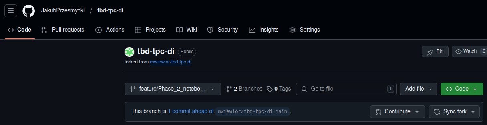

IMPORTANT ❗ ❗ ❗ Please remember to destroy all the resources after each work session. You can recreate infrastructure by creating new PR and merging it to master.


0. The goal of this phase is to create infrastructure, perform benchmarking/scalability tests of sample three-tier lakehouse solution and analyze the results using:
* [TPC-DI benchmark](https://www.tpc.org/tpcdi/)
* [dbt - data transformation tool](https://www.getdbt.com/)
* [GCP Composer - managed Apache Airflow](https://cloud.google.com/composer?hl=pl)
* [GCP Dataproc - managed Apache Spark](https://spark.apache.org/)
* [GCP Vertex AI Workbench - managed JupyterLab](https://cloud.google.com/vertex-ai-notebooks?hl=pl)

Worth to read:
* https://docs.getdbt.com/docs/introduction
* https://airflow.apache.org/docs/apache-airflow/stable/index.html
* https://spark.apache.org/docs/latest/api/python/index.html
* https://medium.com/snowflake/loading-the-tpc-di-benchmark-dataset-into-snowflake-96011e2c26cf
* https://www.databricks.com/blog/2023/04/14/how-we-performed-etl-one-billion-records-under-1-delta-live-tables.html

2. Authors:

   ***Group number: 1***

   ***Wykonali:***
   
   ***Jakub Przesmycki 314241***

   ***Maksymilian Banach 314013***

   ***Link to forked repo: https://github.com/JakubPrzesmycki/tbd-workshop-1***

   Calosc wykonywana byla na systemie linux (Ubuntu 20.04.6 LTS)


3. Sync your repo with https://github.com/bdg-tbd/tbd-workshop-1.

   Repozytorium zostalo zsynchronizowane.


4. Provision your infrastructure.


   a) setup Vertex AI Workbench `pyspark` kernel as described in point [8](https://github.com/bdg-tbd/tbd-workshop-1/tree/v1.0.32#project-setup) 


   b) upload [tpc-di-setup.ipynb](https://github.com/bdg-tbd/tbd-workshop-1/blob/v1.0.36/notebooks/tpc-di-setup.ipynb) to 
   the running instance of your Vertex AI Workbench
   


5. In `tpc-di-setup.ipynb` modify cell under section ***Clone tbd-tpc-di repo***:


   a) first, fork https://github.com/mwiewior/tbd-tpc-di.git to your github organization.



   b) create new branch (e.g. 'notebook') in your fork of tbd-tpc-di and modify profiles.yaml by commenting following lines:
   ```  
        #"spark.driver.port": "30000"
        #"spark.blockManager.port": "30001"
        #"spark.driver.host": "10.11.0.5"  #FIXME: Result of the command (kubectl get nodes -o json |  jq -r '.items[0].status.addresses[0].address')
        #"spark.driver.bindAddress": "0.0.0.0"
   ```
   This lines are required to run dbt on airflow but have to be commented while running dbt in notebook.


   Stworzono nowy branch o nazwie "feature/phase_2a", na ktorym zakomentowano linie kodu wskazane w instrukcji powyzej.

   c) update git clone command to point to ***your fork***.


   Zdjecie powyzej przedstawia sklonowane repozytorium, i zmiany ktore uprzednio wprowadzono w kodzie.


6. Access Vertex AI Workbench and run cell by cell notebook `tpc-di-setup.ipynb`.


   a) in the first cell of the notebook replace: `%env DATA_BUCKET=tbd-2023z-9910-data` with your data bucket.

   
   b) in the cell:
         ```%%bash
         mkdir -p git && cd git
         git clone https://github.com/mwiewior/tbd-tpc-di.git
         cd tbd-tpc-di
         git pull
         ```
      replace repo with your fork. Next checkout to 'notebook' branch.
   

   c) after running first cells your fork of `tbd-tpc-di` repository will be cloned into Vertex AI  enviroment (see git folder).

   ***Sklonowane repozytorium widoczne jest na zdjeciu w podpunkcie nr 5.***

   d) take a look on `git/tbd-tpc-di/profiles.yaml`. This file includes Spark parameters that can be changed if you need to increase the number of executors and
  ```
   server_side_parameters:
       "spark.driver.memory": "2g"
       "spark.executor.memory": "4g"
       "spark.executor.instances": "2"
       "spark.hadoop.hive.metastore.warehouse.dir": "hdfs:///user/hive/warehouse/"
  ```
   
   ***Plik zostal przeanalizowany, jest on rowniez widoczny na zdjeciu w podpunkcie nr 5.***


7. Explore files created by generator and describe them, including format, content, total size.

Output z terminala:
 
 


- Laczny rozmiar wygenerowanych plików wynosi: 9,6 GiB.

- Generator wygenerowal dane w postaci trzech batchy.

- Kazdy z batchy zawiera pliki w formatach: csv, txt, xml, bez podanego rozszerzenia.

Statystyki dotyczące rozmiarow plikow dla poszczegolnych typow danych:

    StatusType: 3,6 KiB
    TaxRate: 16,7 KiB
    Date: 3,3 MiB
    Time: 4,6 MiB
    BatchDate: 88 B
    HR: 39,6 MiB
    CustomerMgmt: 298,1 MiB
    Customer: 205,3 KiB
    Account: 149,6 KiB
    Prospect: 300,2 MiB
    Industry: 2,7 KiB
    FINWIRE: 1 GiB 
    DailyMarket: 3 GiB
    WatchHistory: 1,3 GiB
    TradeSource: 3,6 GiB
    TradeType: 5 rows

   Ponizej znajduja sie informacje ogolne i informacje o batchach:


Batch 1:
 

Batch 2:
 

Batch 3:
 


8. Analyze tpcdi.py. What happened in the loading stage?


   Plik `tpcdi.py` zajmuje się tworzeniem tabel na podstawie danych z generatora podczas etapu ładowania (loading stage).
   Na początku tworzona jest sesja Sparka oraz odpowiednie bazy danych, a baza `digen` zostaje ustawiona jako domyślna. 
   Dla każdej z tabel definiowana jest struktura, a dane wczytywane są bezpośrednio z plików. Na podstawie tych danych 
   tworzone są struktury typu DataFrame, które następnie zapisywane są w formacie Parquet, tworząc tabele w bazie danych `digen`.

 
 


9. Using SparkSQL answer: how many table were created in each layer?

Ponizsze zdjecie przedstawia, ze tabelki zostaly utworzone prawidlowo:
 

   Ilosc utworzonych tabelek w poszczegolnych warstwach:
- demo_bronze: 17, 
- demo_silver: 14, 
- demo_gold:   12,
- W warstwach: bronze, silver oraz gold nie zostaly utworzone zadne tabele.

Informacje o tabelkach:
 
 
 
 
 

10. Add some 3 more [dbt tests](https://docs.getdbt.com/docs/build/tests) and explain what you are testing. ***Add new tests to your repository.***

Proba uruchomienia testow przed dodaniem kolejnych przebiegla pomyslnie, co przedstawiono na ponizszym zdjeciu:


W kolejnym kroku dodano 3 nowe testy:


- test 1: Zapytanie identyfikuje identyfikatory kont (sk_account_id), które występują więcej niż raz w tabeli dim_account, licząc ich wystąpienia.


- test 2: Zapytanie pobiera informacje o transakcjach (sk_current_trade_id, trade_timestamp) z tabeli fact_holdings, łącząc je z tabelą dim_account, 
   gdzie transakcje mają znacznik czasu (trade_timestamp) poza zakresem czasowym (effective_timestamp lub end_timestamp) powiązanym z kontem.


- test 3: Zapytanie pobiera identyfikatory klientów (sk_customer_id) z tabeli fact_watches, gdzie data umieszczenia (sk_date_placed) jest późniejsza 
   niż data usunięcia (sk_date_removed) lub — jeśli brak daty usunięcia — sama data umieszczenia.


Ostatnim krokiem bylo ponowne uruchomienie testow, ktore rowniez przebieglo pomyslnie:


11. In main.tf update
   ```
   dbt_git_repo            = "https://github.com/mwiewior/tbd-tpc-di.git"
   dbt_git_repo_branch     = "main"
   ```
   so dbt_git_repo points to your fork of tbd-tpc-di. 


   Plik zostal zaktualizowany zgodnie z powyzsza instrukcja.


12. Redeploy infrastructure and check if the DAG finished with no errors:

 
