IMPORTANT ❗ ❗ ❗ Please remember to destroy all the resources after each work session. You can recreate infrastructure by creating new PR and merging it to master.
  

1. Authors:

   Group number: 1

   Link to forked repo: https://github.com/JakubPrzesmycki/tbd-workshop-1.git
   
2. Follow all steps in README.md.
    
    Poniżej przedstawiamy efekt wykonania README.md, czym był poprawnie zrealizowany pull request oraz release.

    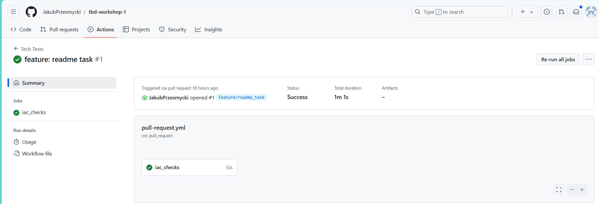

    

3. Select your project and set budget alerts on 5%, 25%, 50%, 80% of 50$ (in cloud console -> billing -> budget & alerts -> create buget; unclick discounts and promotions&others while creating budget).

    Ustawione limity:

    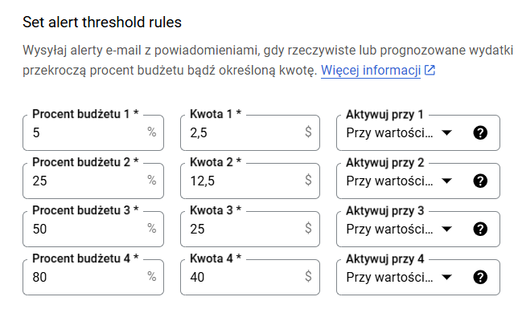

5. From avaialble Github Actions select and run destroy on main branch.
   
    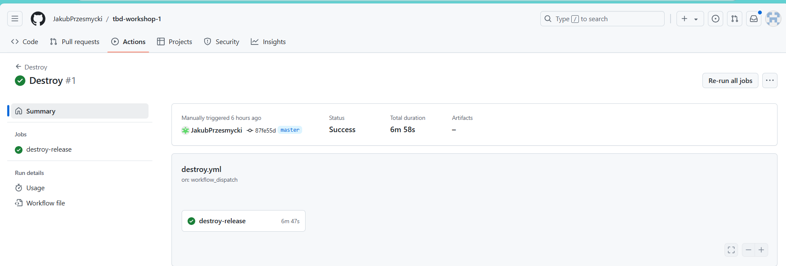

6. Create new git branch and:
    1. Modify tasks-phase1.md file.
    
    2. Create PR from this branch to **YOUR** master and merge it to make new release. 
    
    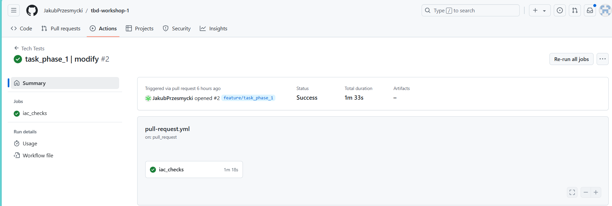

    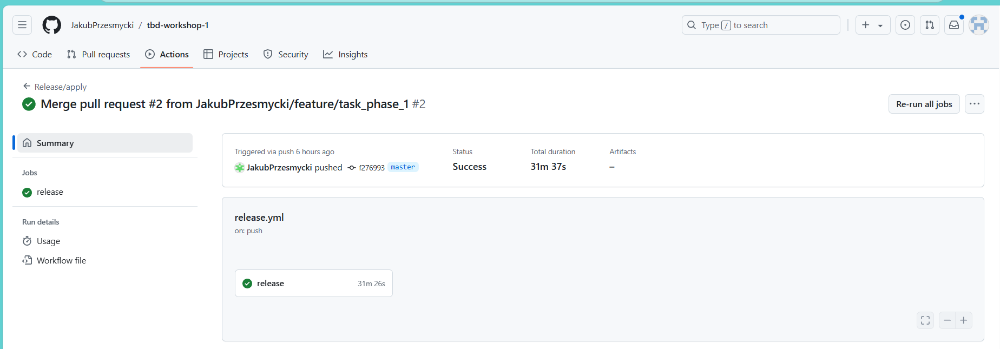

    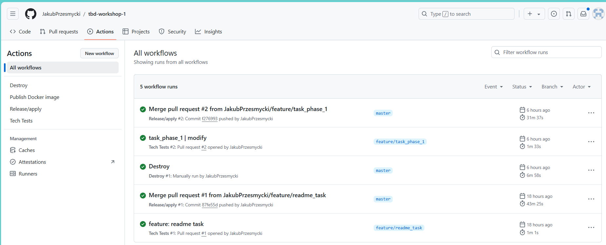

7. Analyze terraform code. Play with terraform plan, terraform graph to investigate different modules.

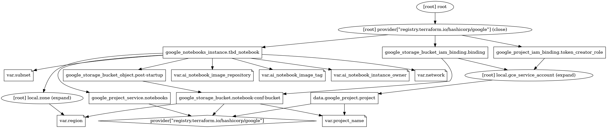

Moduł vertex-ai-workbench to środowisko oparte na Jupyter Notebook, które integruje się z usługami Google Cloud, 
umożliwiając kompleksowe zarządzanie cyklem życia projektów uczenia maszynowego. Dzięki niemu w jednym miejscu można 
eksplorować i analizować dane, tworzyć i trenować modele, wdrażać modele.
 
Główną funkcją modułu jest uruchamianie maszyny wirtualnej, co odbywa się za pomocą zasobu google_notebooks_instance. 
Odpowiada on  za konfigurację oraz przygotowanie środowiska pracy. google_project_service realizuje zarządzanie dostępem
do usług Google, takich jak API notebooków, Natomiast google_project_iam_binding jest wykorzystywany do umożliwienia 
korzystania z tych usług przez konto serwisowe, które służy do generowania tymczasowych poświadczeń.
 
Zasób google_storage_bucket  zapewnia przestrzeń do przechowywania plików w Google Cloud Storage (GCS), jest tworzony 
przez moduł vertex-ai-workbench. Dane ograniczone są jedynie do odczytu, a dostęp do nich przyznawany jest kontu 
serwisowemu za pomocą zasobu google_storage_bucket_iam_binding. Zasób google_storage_bucket_object służy do przesyłania 
skryptu inicjalizacyjnego, który uruchamia się po starcie maszyny, do przestrzeni GCS podczas wykonywania polecenia 
terraform apply.
 
 
Po wywołaniu komendy terraform graph -type=plan | dot -Tpng >graph.png w modules/vertex-ai-workbench wygenerowany został 
graf zależności w konfiguracji Terraform dla infrastruktury w Google Cloud Platform (GCP). Pokazuje, jak poszczególne 
zasoby, zmienne i moduły są ze sobą powiązane.
   
8. Reach YARN UI
   
    Pierwszym krokiem bylo zdefiniowanie zmiennych srodowiskowych:
     - export PROJECT=tbd-2023l-314241
     - export HOSTNAME=tbd-cluster-m
     - export ZONE=europe-west1-d
     - export PORT=1080
   
    Nastepnie utworzylismy tunel SSH przy pomocy komendy:
     - gcloud compute ssh ${HOSTNAME} --project=${PROJECT} --zone=${ZONE} -- -D ${PORT} -N

    Po wlaczeniu przegladarki "firefox", w ustawieniach sieci wybralismy manualna konfiguracje proxy.
    W sekcji SOCKS Host wprowadzilismy localhost oraz port, oraz zaznaczylismy opcje SOCKS v5.

    Koncowym etapem bylo przejscie do YARN UI, wykorzystujac  URL: http://tbd-cluster-m:8088/
        *(8088 to port dla YARN ResourceManager w daraproc)
    
    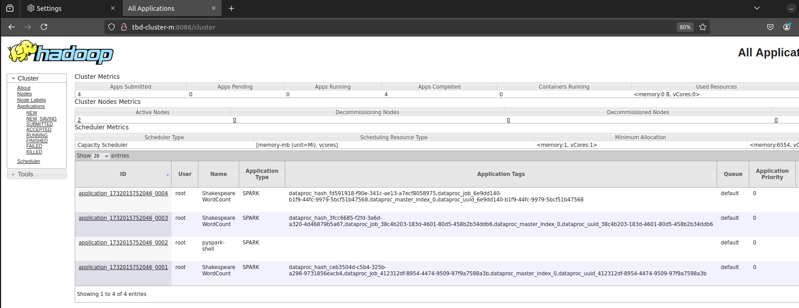

    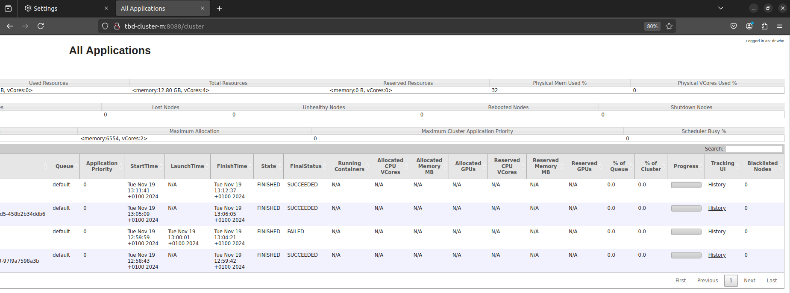

9. Draw an architecture diagram (e.g. in draw.io) that includes:

i. VPC topology with service assignment to subnets

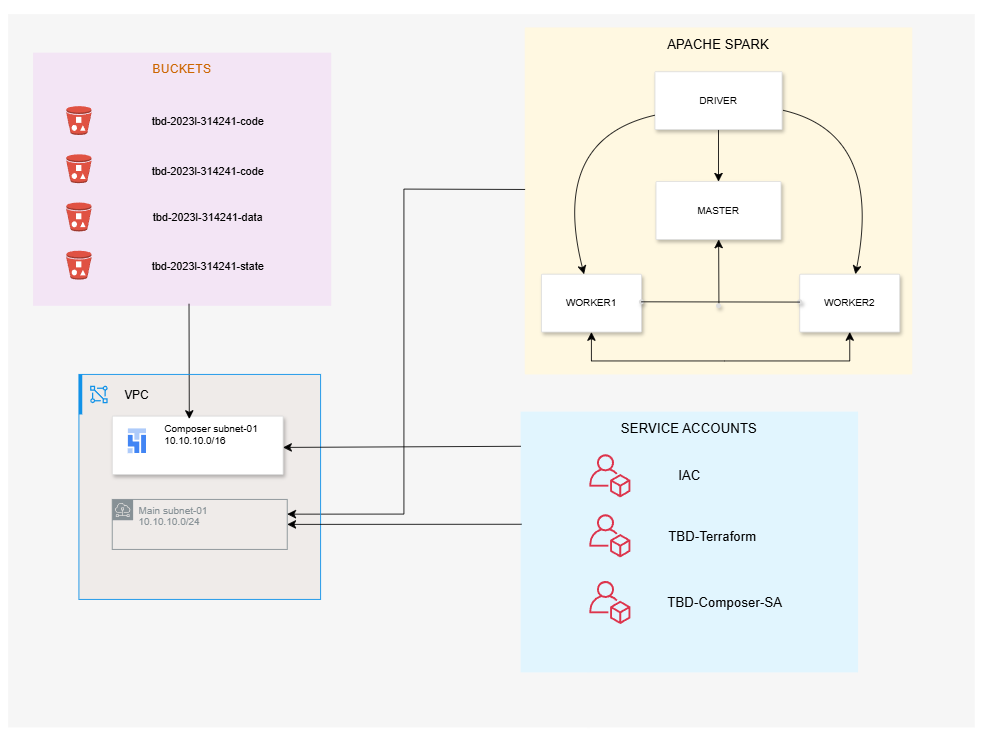

ii. Description of the components of service accounts

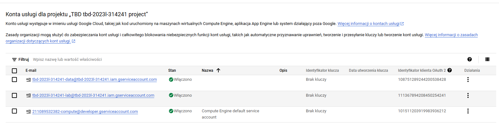

tbd-2023-314241-data@tbd-2023-314241.iam.gserviceaccount.com: przeznaczone do zarządzania danymi projektu, np. dostęp do Cloud Storage lub BigQuery.
tbd-2023-314241-lab@tbd-2023-314241.iam.gserviceaccount.com: przeznaczone do zarządzania infrastrukturą projektu w Google Cloud za pośrednictwem Terraform.
211089532382-compute@developer.gserviceaccount.com (Domyślne konto Compute Engine): Automatycznie tworzone przez Compute Engine i używane do obsługi instancji oraz powiązanych zasobów.

iii. List of buckets for disposal

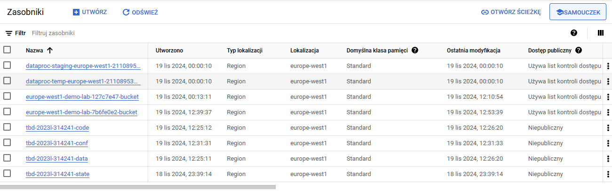 

tbd-2023l-314241-code -> przechowuje kody źródłowe
tbd-2023l-314241-conf -> przechowuje pliki konfiguracyjne
tbd-2023l-314241-data -> przechowuje dane związane z projektem
tbd-2023l-314241-state -> przechowuje informacje o stanie, tj. checkpointy czy logi.

iv. Description of network communication (ports, why it is necessary to specify the host for the driver) of Apache Spark running from Vertex AI Workbech

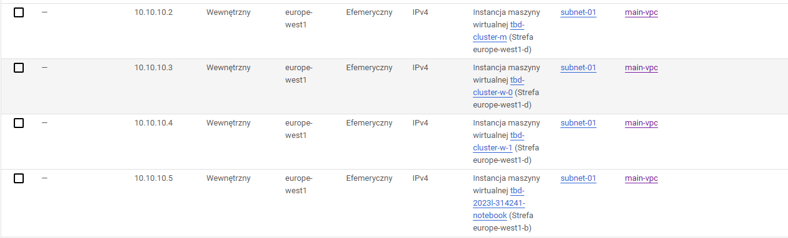

Wszystkie maszyny wirtualne pracują w podsieci subnet-01. 

Określenie hosta dla Apache Spark działającego z Vertex AI Workbench jest kluczowe, ponieważ pozwala na poprawną konfigurację komunikacji między komponentami Spark a środowiskiem Vertex AI. Dzięki temu możliwa jest efektywna 	wymiana danych i współdziałanie w chmurze, co umożliwia skuteczne zarządzanie zasobami oraz minimalizuje ryzyko problemów związanych z niezgodnością sieciową lub błędami w lokalizacji usług.

10. Create a new PR and add costs by entering the expected consumption into Infracost
For all the resources of type: `google_artifact_registry`, `google_storage_bucket`, `google_service_networking_connection`
create a sample usage profiles and add it to the Infracost task in CI/CD pipeline. Usage file [example](https://github.com/infracost/infracost/blob/master/infracost-usage-example.yml)

Spodziewane wartosci konsumpcji (wykorzystano plik dostarczony przez prowadzcego):

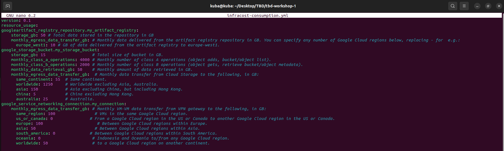

Wywołaniu komendy infracost breakdown --path . --usage-file infracost-usage.yml otrzymaliśmy następujący rezultat: 

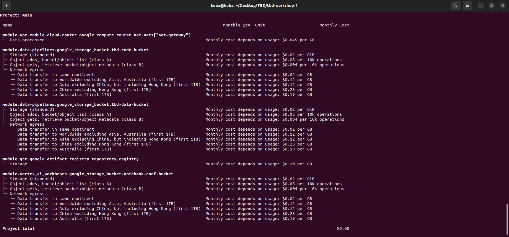

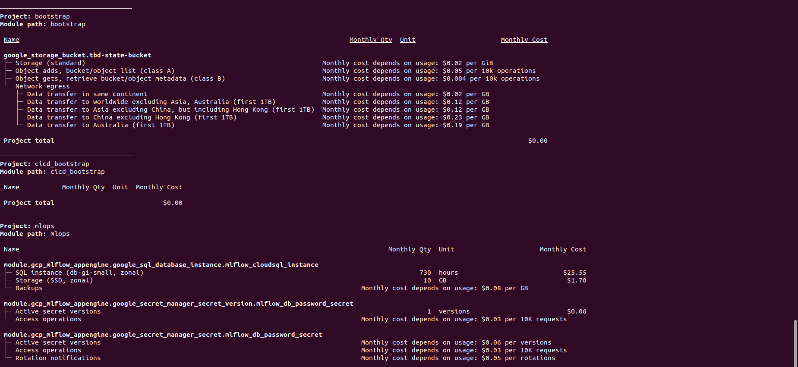
    
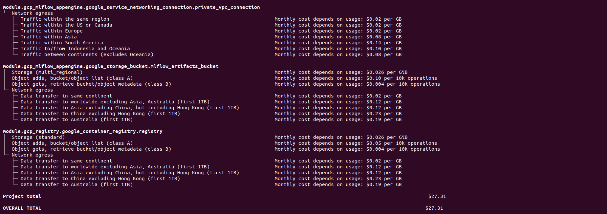

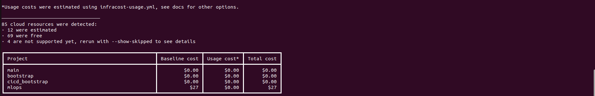

11. Create a BigQuery dataset and an external table using SQL

CREATE SCHEMA IF NOT EXISTS demo OPTIONS(location = 'europe-west1');

CREATE OR REPLACE EXTERNAL TABLE demo.shakespeare OPTIONS (

format = 'ORC', uris = ['gs://tbd-2023l-314241-data/data/shakespeare/.orc'])

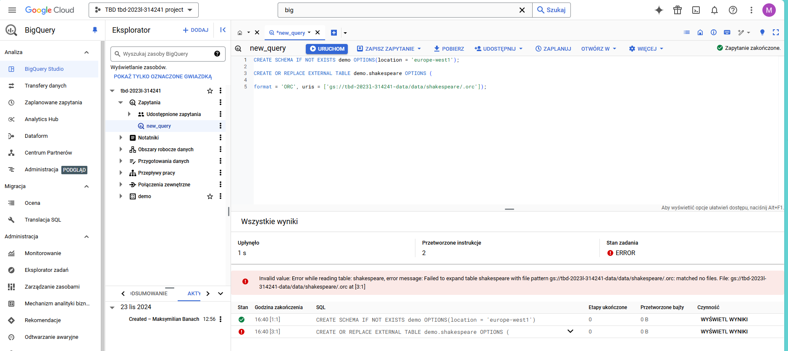

Błąd wskazujący na brak pliku shakespeare.

***Dlaczego ORC nie wymaga schematu tabeli?***

Format ORC nie wymaga osobnego schematu, ponieważ wbudowane metadane, takie jak nazwy pól i typy danych, opisują strukturę danych bezpośrednio w pliku. Dzięki temu narzędzia takie jak BigQuery mogą automatycznie odczytać schemat podczas importu, upraszczając pracę z danymi.

Dalsze kroki zostaną zrealizowane po naprawie usunięcia job'ow.   
12. Start an interactive session from Vertex AI workbench:

PySparkRuntimeError(

pyspark.errors.exceptions.base.PySparkRuntimeError: [PYTHON_VERSION_MISMATCH] Python in worker has different version (3, 8) than that in driver 3.10, PySpark cannot run with different minor versions.
Please check environment variables PYSPARK_PYTHON and PYSPARK_DRIVER_PYTHON are correctly set.

Komunikat o błędzie wskazuje na problem z różnicą w wersjach Pythona między driver'ami a worker'ami w aplikacji Spark.

Driver: Python 3.10

Worker: Python 3.8

Pomimo próby przeinstalowania wersji Python'a do wersji 3.8, ale także ustawienia zmiennych w konfiguracji PySpark nie udało nam się rozwiązać powyższego problemu.
   
13. Find and correct the error in spark-job.py

Zmiana zmiennej DAT_BUCKET w pliku pyspark_job.py:

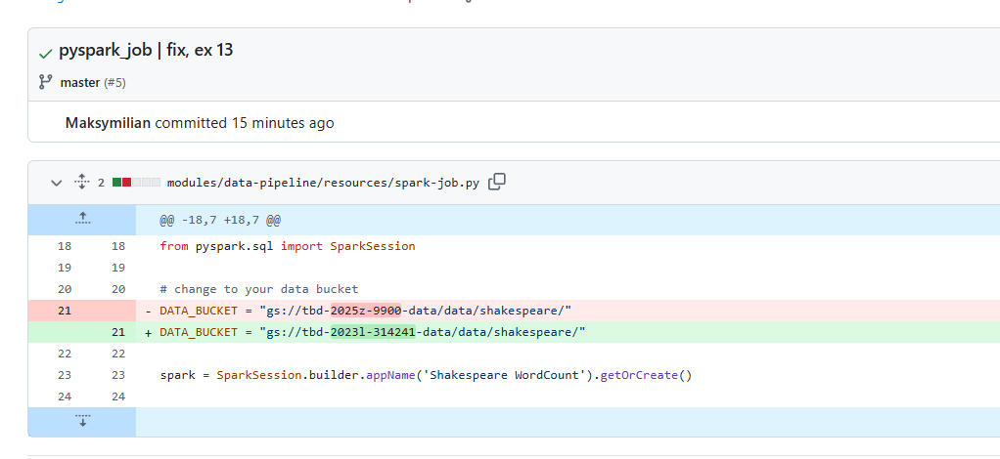

14. Additional tasks using Terraform:

    1. Add support for arbitrary machine types and worker nodes for a Dataproc cluster and JupyterLab instance

    https://github.com/JakubPrzesmycki/tbd-workshop-1/commit/d75251325d074d6e7e9c4165485bdcf5170a4a7d
    
    2. Add support for preemptible/spot instances in a Dataproc cluster

    https://github.com/JakubPrzesmycki/tbd-workshop-1/commit/2bd6fbd2a37b7f4a212ddd2c49402f466fb806de
    
    3. Perform additional hardening of Jupyterlab environment, i.e. disable sudo access and enable secure boot
    
    https://github.com/JakubPrzesmycki/tbd-workshop-1/commit/30eaf29b1b02d0a8da7a55a5ea40feda7956f687

    4. (Optional) Get access to Apache Spark WebUI

    ***place the link to the modified file and inserted terraform code***

***Ostateczny release przebiegł pomyślnie:***

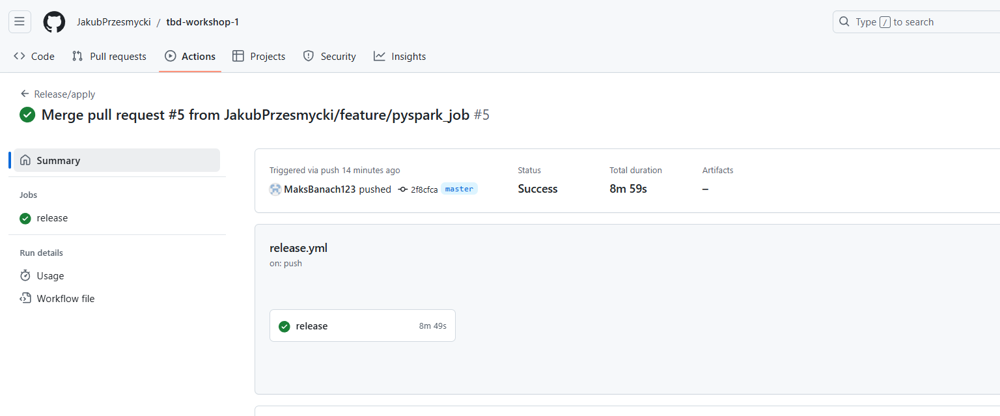
